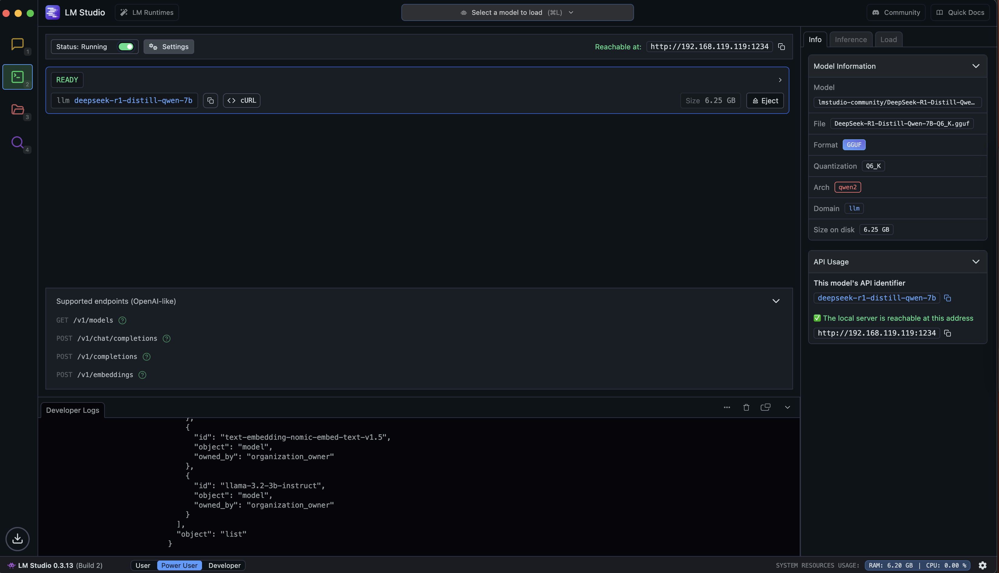

# Table of Contents

1. [Setup environment](#id-lession1)

	1.1 [python3](#id-lession1.1)

	1.2 [install libpq](#id-lession1.2)

	1.3 [virtual environment](#id-lession1.3)

	1.4 [Enable API on LMStudio](#id-lession1.4)


<div id='id-lession1'>

<div style="color:red; font-size:32px">
1. Setup environment
</div>


Setup VScode


Then you can press `Shift + Enter` to run code


<div id='id-lession1.1'>

# 1.1 python3

```bash
brew install python3

# for special version
brew install python3@3.12
```

<div id='id-lession1.2'>

# 1.2 install libpq

```bash
brew install libpq

echo 'export PATH="/opt/homebrew/opt/libpq/bin:$PATH"' >> /Users/namnv/.zshrc

pip install --upgrade pip setuptools

brew install openssl
export LDFLAGS="-L$(brew --prefix openssl)/lib"
export CPPFLAGS="-I$(brew --prefix openssl)/include"
export PKG_CONFIG_PATH="$(brew --prefix openssl)/lib/pkgconfig"

```

<div id='id-lession1.3'>

# 1.3 virtual environment

```bash
python -m venv venv

1. Linux/macOS:
source venv/bin/activate

2. Windows: 
.\venv\Scripts\activate


3. Install requirements
pip install -r requirements.txt
```

<div id='id-lession1.4'>

# 1.4 Enable API on LMStudio

Start LLM model



Now you can call API to local LLM running on LMStudio

Reference: https://lmstudio.ai/docs/app/api/endpoints/rest


